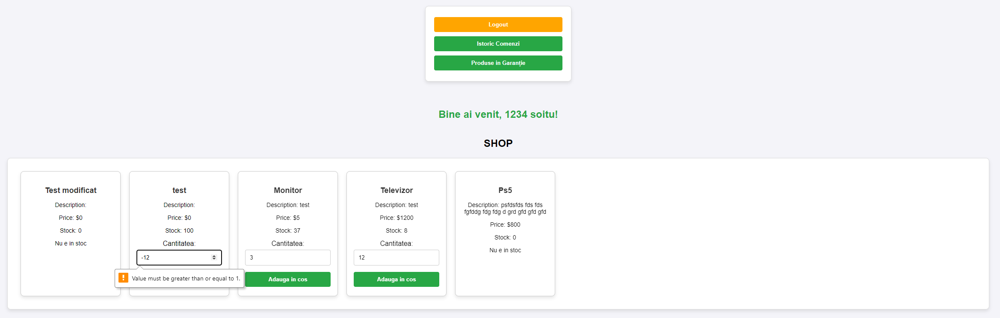

# **Proiect DAW**

> **Description:**  
A php project made by Șoitu Viorel for university.

## **Features**

- Login and Register system, with detailed server side validation and error feedback, session handling, password hashing and more, all using the MVC design pattern
- Moderate security: Protection from sql injections (prepare statements), html sanitization, password hashing
- CRUD forms for 2 database schemas
- Add to cart feature with custom amount, removal button and price total
- Buy feature using database, history and warranty tracking
- Database constrains
- Client UI

## **Screenshots**

